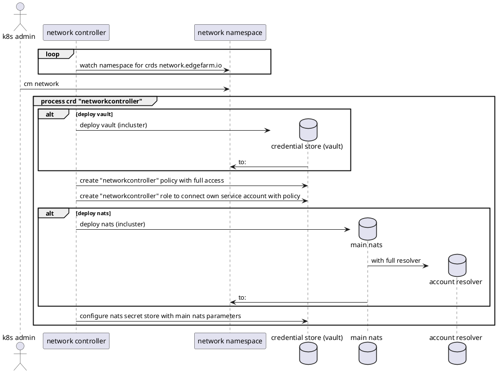
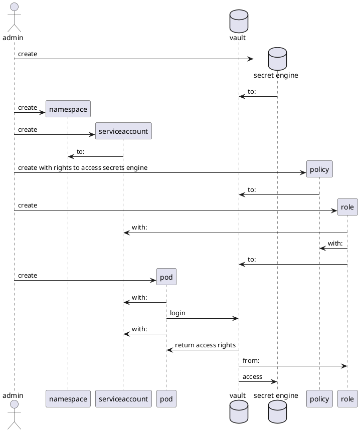
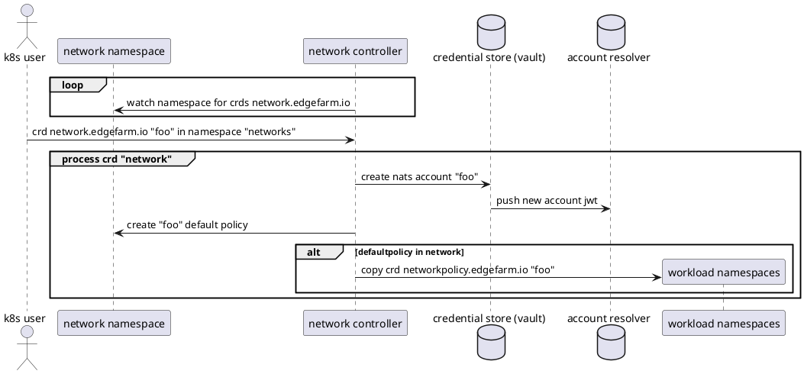
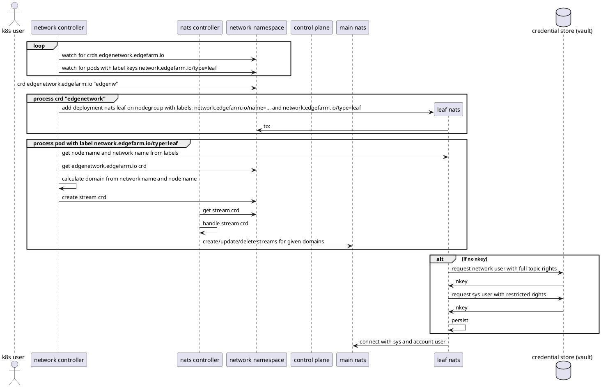
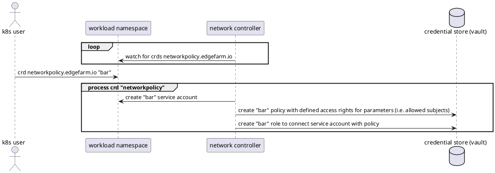
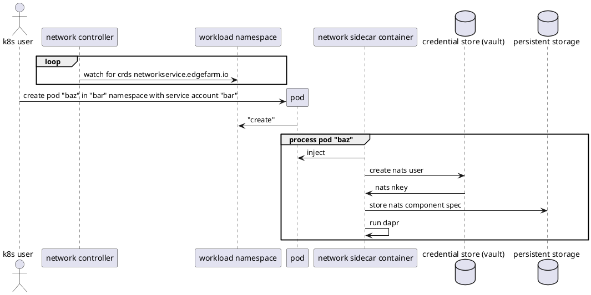

# edgefarm.network (nextgen)

<!-- ## Introduction

At the current time `anck` needs a refactoring of how the edgefarm.network is created and handled.

## Motivation

To make things easier and more maintainable, we will create a bunch of further CRDs for the edgefarm.network.
Currently there are two CRDs:
- network
- participant

Whereas the network CRD is used to create the edgefarm.network, the participant CRD is used to make components part of a network. Currently the network controller takes care of pretty much everything what makes things complicated:
- creating and deletion of the network
- creation of streams for both cloud and edge nodes
- handling participants on the fly with their streams (participating components/nodes can enter and leave any time)
- creating secrets that contain components credentials

## Goals

One goal is to make edgefarm.network more maintainable and easier to adapt for new features.
The functionality shall have the following features:

- create and delete networks
- create and delete participants
- create and delete streams
- create and delete credentials (both automatically or manually)
- map credentials to streams
- map streams to a edge node entity

## Non-Goals

adding features that are not yet implemented:
- stream mirroring
- imports/exports
- stream encryption -->

## Overview

### custom ressources

```plantuml

[network controller] as controller

card "custom ressources" as cr {
    file "network.edgefarm.io" as nw
    file "policy.network.edgefarm.io" as policy
    file "edgenetwork.network.edgefarm.io" as edgenw
    file "stream.network.edgefarm.io" as stream
}

controller --> cr : <<watches>>

cr *-- nw : 0..n
nw *-- policy : 0..n
nw *-- edgenw : 0..n
nw *-- stream : 0..n


```

## deployment

Der Network-Controller wird in den namespace "network" deployed.

> edgefarm.network ist noch nicht initialisiert und wartet auf eine initiale Konfiguration.

```plantuml

actor "k8s admin" as admin

package k8s {

    package "network namespace" as namespace {

        [network controller] as controller
    }
}

admin --> controller : <<deploy>>

controller -> namespace : <<watch>>

```

### network configmap

In der initialen Konfiguration wird definiert, ob alle benötigten basiskomponenten deployed werden und wie diese erreichbar sind (intern/extern). Das ermöglicht ein einfaches "all-in-one"-Setup als auch das auslagern bestimmter kritischer Komponenten.

> edgefarm.network ist initialisiert und wartet auf weitere netzwerk-ressourcen

 ```plantuml

actor "k8s admin" as admin

package k8s {

    package "network namespace" {

        database "credential store (vault)" as vault
        [main nats] as mainnats
        database "account resolver" as mainresolver
        [network controller] as controller

        file "configmap network" as manifest
    }
}

interface leafif as "leaf"
interface clientif as "client service endpoint"

admin --> manifest : <<deploy>>
controller -> manifest : <<watch>>

controller --> vault : (optional) <<deploy>>
controller ~~> vault : <<acces>>
controller -> mainnats : (optional) <<deploy>>
controller ~> mainnats : <<acces>>


mainnats *-- mainresolver : <<full resolver>>
vault -> mainresolver : <<updates>>
mainnats -up- leafif : <<provide>>
mainnats -up- clientif : <<provide>>

@enduml
```



## Authentication and Authorization

### AuthN/AuthZ with service accounts

```plantuml

package k8s {
    [service account] as serviceaccount
    [namespace] as namespace
    [pod] as pod
}

package vault {
    [role] as role
    [policy] as policy
    database "secret engine" as db
}

namespace *- pod
namespace *- serviceaccount

serviceaccount ~> pod : <<assigned>>
pod ~> serviceaccount : <<uses>>

policy ~> role : <<assigned>>
serviceaccount ~> role : <<assigned>>

pod -down-> db : <<authenticate>>

policy -> db : <<restrict access>>

@enduml
```



## Custom Ressorces

### network.edgefarm.io

Über diese ressource werden von einnander isolierte Netzerke erzeugt.

```plantuml

package k8s {

    package "workload namespaces" as namespaces {
        [network default policy <<optional>>] as policy
    }

    package "network namespace" as backend {

        file "network.edgefarm.io" as manifest

        database "credential store (vault)" as vault
        database "account resolver" as mainresolver

        vault -> mainresolver : <<updates>>

        [network controller] as controller

    }
}

actor "k8s user" as user

user --> manifest : <<apply>>
controller -> manifest : <<watch>>

controller -up-> namespaces : <<prepare>>
controller -> namespaces : <<watch>>

controller ---> vault : <<configure>>

@enduml
```



#### CRD API Group and Version

| Field                 | Description             |
|-----------------------|-------------------------|
|Group                  | network.edgefarm.io     |
|APIVersion             | v1alpha1                |
|Kind                   | Network                 |
|Spec                   | @Network.Spec           |

#### Network Type Definition

```go

type NetworkSpec struct {

    // Namespaces is a list of k8s namespaces whose workload can access the network.
    Namespaces []string `json:"namespaces"`

    // Limits what can be max consumed by all streams etc. in nats main cluster
    //
    // For valid units @see https://kubernetes.io/docs/concepts/configuration/manage-resources-containers/#meaning-of-memory
    Limits struct {
        // FileStorage defines the max aviable capacity that can be used for jetstreams on file storage backend
        FileStorage string  `json:"filestorage,omitempty"`
        // InMemoryStorage defines the max aviable capacity that can be used for jetstreams on inmemory storage backend
        InMemoryStorage string `json:"immemorystorage,omitempty"`
    }

    // DefaultNetworkPolicy either by reference to existing policy, or define policy inline
    DefaultNetworkPolicy struct {
        // Ref references a exisiting spec
        Ref string `json:"ref,omitempty"`
         // Spec defines the default policy
        Spec NetworkPolicy `json:"spec,omitempty"`
    }
}
```

### edgenetwork.network.edgefarm.io

Über diese ressource werden subnetze auf nodes erzeugt, mit eigenen speicherlimmits und puffern.
Verwendet für unreliable netzwerke, bei denen eine lokale daten (zwischen-)speicherung notwendig wird.

Hierfür wird auf den entsprechenden nodes ein lokaler leaf nats server deployed, der sich zum main nats verbindet.

```plantuml

actor "k8s user" as user
package k8s {

    package "workload namespaces" as workload {
        package "nodegroup" as edgenetwork {
            [leaf nats] as leafnats
            database "cached resolver" as leafresolver

            leafnats *-- leafresolver
        }
    }

    package "network namespace" as backend {

        database "credential store (vault)" as vault
        [main nats] as mainnats
        database "account resolver" as mainresolver

        mainnats *-- mainresolver
        vault -> mainresolver : <<updates>>

        [network controller] as controller

           file "edgenetwork.network.edgefarm.io" as manifest
    }

}

interface leafif as "leaf"
interface clientif as "client service endpoint"

controller ----> manifest : <<watch>>
user ---> manifest : <<apply>>

controller -left-> edgenetwork : <<deploy>>
controller -----> leafnats : <<set labels>>

mainnats -up- leafif : <<provide>>

leafnats -up- clientif : <<provide>>
leafnats -> leafif : <<connect>>
leafresolver <~> mainresolver : <<sync>>

@enduml
```



#### CRD API Group and Version

| Field                 | Description             |
|-----------------------|-------------------------|
|Group                  | network.edgefarm.io     |
|APIVersion             | v1alpha1                |
|Kind                   | EdgeNetwork             |

#### Network Type Definition

```go

type EdgeNetworkSpec struct {

    // Network name of the network to which the edge network is assigned to
    Network string

    // NodeSelector selects k8s nodes by labels on which the EdgeNetwork is set up and accessible
    NodeSelector map[string]string

    // Limits what can be max consumed by all streams on each of the selected nodes
    //
    // For valid units @see https://kubernetes.io/docs/concepts/configuration/manage-resources-containers/#meaning-of-memory
    Limits struct {
        // FileStorage defines the max aviable capacity that can be used for jetstreams on file storage backend
        FileStorage string  `json:"filestorage,omitempty"`
        // InMemoryStorage defines the max aviable capacity that can be used for jetstreams on inmemory storage backend
        InMemoryStorage string `json:"immemorystorage,omitempty"`
    }
}
```

### policy.network.edgefarm.io

Über diese ressource werden benutzerrechte und limits für ein netzwerk gesetzt.
Diese policies können gruppen von workload zugeordnet werden (über service accounts),
welche dann Zugangsdaten zum Netzwerk mit den entsprechenden Rechten anfordern können.



#### CRD API Group and Version

* Network

| Field                 | Description             |
|-----------------------|-------------------------|
|Group                  | network.edgefarm.io     |
|APIVersion             | v1alpha1                |
|Kind                   | Policy                  |

#### NetworkPolicy Type Definition

```go
// NetworkPolicy defines network access permissions and restrictions
type NetworkPolicy struct {
    // AllowPub adds publish permissions for specified subjects
    AllowPub []string `json:"allowpub,omitempty"`

    // AllowSub adds subscribe permissions for specified subjects
    AllowSub []string `json:"allowsub,omitempty"`

    // DenyPub adds deny publish permissions for specified subjects
    DenyPub []string `json:"denypub,omitempty"`

    // DebySub adds deny subscribe permissions for specified subjects
    DebySub []string `json:"denysub,omitempty"`
}
```

### stream.network.edgefarm.io

```plantuml

package k8s {
    package "workload namespaces" as namespaces {
        file "stream.network.edgefarm.io" as manifest
    }

    package "network namespace" as backend {
        [nats controller] as natscontroller
        [nats] as nats

         file "stream.nats" as natsmanifest
        [network controller] as controller
    }
}

actor "k8s user" as user

user --> manifest : <<apply>>
controller -> manifest : <<watch>>

controller --> natsmanifest : <<create nats crds>>
natscontroller -> natsmanifest : <<watch>>
natscontroller --> nats : <<create stream>>

@enduml

```

#### CRD API Group and Version

| Field                 | Description             |
|-----------------------|-------------------------|
|Group                  | stream.edgefarm.io      |
|APIVersion             | v1alpha1                |
|Kind                   | Stream                  |

#### Stream Type Definition

```go
// // SubjectSpec defines the desired state of Subject
// type SubjectSpec struct {
//     // Name defines the name of the subject
//     Name string `json:"name"`

//     // Stream defines the stream name for the subject
//     Stream string `json:"stream"`
// }

// StreamLinkSpec defines the desired state of a linked stream
type StreamLinkSpec struct {
    // Stream is the name of the linked stream
    Stream string `json:"stream,omitempty"`
}

// StreamConfigSpec defines the configuration of a Stream
type StreamConfigSpec struct {
    // Storage - Streams are stored on the server, this can be one of many backends and all are usable in clustering mode.
    Storage string `json:"storage,omitempty"`
    // Retention - Messages are retained either based on limits like size and age (Limits), as long as there are Consumers (Interest) or until any worker processed them (Work Queue)
    Retention string `json:"retention,omitempty"`
    // MaxMsgsPerSubject defines the amount of messages to keep in the store for this Stream per unique subject, when exceeded oldest messages are removed, -1 for unlimited.
    MaxMsgsPerSubject int64 `json:"maxMsgsPerSubject,omitempty"`
    // MaxMsgs defines the amount of messages to keep in the store for this Stream, when exceeded oldest messages are removed, -1 for unlimited.
    MaxMsgs int64 `json:"maxMsgs,omitempty"`
    // MaxBytes defines the combined size of all messages in a Stream, when exceeded oldest messages are removed, -1 for unlimited.
    MaxBytes int64 `json:"maxBytes,omitempty"`
    // MaxAge defines the oldest messages that can be stored in the Stream, any messages older than this period will be removed, -1 for unlimited. Supports units (s)econds, (m)inutes, (h)ours, (d)ays, (M)onths, (y)ears.
    MaxAge string `json:"maxAge,omitempty"`
    // MaxMsgSize defines the maximum size any single message may be to be accepted by the Stream.
    MaxMsgSize int32 `json:"maxMsgSize,omitempty"`
    // Discard defines if once the Stream reach it's limits of size or messages the 'new' policy will prevent further messages from being added while 'old' will delete old messages.
    Discard string `json:"discard,omitempty"`
}

// StreamSpec defines the desired state of Stream
type StreamSpec struct {
    // Name of the stream
    Name string `json:"name"`
    // Location defines where the stream is located ("egde" "main")
    Location string `json:"location"`
    // Link defines the link to another stream
    Link *StreamLinkSpec `json:"link,omitempty"`
    // Streams define the streams that are part of this network
    Config StreamConfigSpec `json:"config"`

    // Subject defines the subjects of the stream
    Subjects []string `json:"subjects"`
}
```

## Deploying Workload

Um Workload einem Netzwerk zuzuordnen wird der workload in einem bestimmten namespace (definiert imn network.edgefarm.io) deployed,
ein label (`network.edgefarm.io=foo`") gesetzt und ein service account zugeordnet.

Daraufhin wird ein sidecar zur workload erstellt (dapr), der sich die entsprechenden zugangsdaten beim vault abholt und damit die verbindung aufbaut.
Die Workload muss nur warten, bis der sidecar über dapr erreichbar ist und kann das kommunizieren beginnen.

```plantuml

package k8s {

    file "pod with label `network.edgefarm.io=foo`" as manifest

   package "workload namespace" {
        package pod {
            [workload container] as workload
            [network sidecar container] as sidecar
        }
    }

    package "network namespace" as namespace {
        [nats main/leaf] as nats
        [network controller] as controller
        database "credential store (vault)" as vault
    }
}

interface "client service endpoint" as clientif

actor "k8s user" as user

controller --> manifest : <<watch>>
user --> manifest : <<apply>>

workload -> sidecar : <<connect>>
sidecar --> vault : <<credentials>>
sidecar -up-> clientif : <<connect>>

nats -- clientif : <<provide>>

controller --> pod : <<extend>>

@enduml
```


