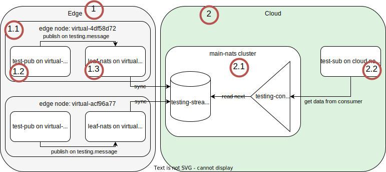

# Testing `edgefarm.network`

## Prerequisits

Make sure you have at least one edge node running in your cluster, e.g. [a virtual edge node](https://github.com/edgefarm/edgefarm.core#-adding-virtual-edge-nodes).
In this example there are two virtual edge nodes running in the cluster.

```console
$ kubectl get nodes
NAME                    STATUS   ROLES                  AGE   VERSION
default-control-plane   Ready    control-plane,master   22h   v1.22.9
default-worker          Ready    <none>                 22h   v1.22.9
virtual-4df58d72        Ready    agent,edge             30m   v1.22.6-kubeedge-v0.0.0-master+$Format:%h$
virtual-acf96a77        Ready    agent,edge             30m   v1.22.6-kubeedge-v0.0.0-master+$Format:%h$
```

## Test application

### Overview

The test application consists of several parts.



The image is divided into two parts:

1. Edge: where all the edge nodes are running
1.1 specific edge node
1.2 application running on edge node that publishes messages to the edge node's leaf-nats server
1.3 edge node's leaf-nats server
2. Cloud: where the cloud components are running
2.1 cloud nats server
2.2 application running on the cloud that reads messages from the stream located on the cloud nats server

In this example there will be a stream created with size of 100 MiB and a consumer that reads messages from the stream.

### Deploying the test application

First off, label the nodeGroups you want to use for this test. In this example all nodeGroups are used and therefore labeled with the same label.

```console
$ kubectl nodegroups.apps.kubeedge.io --all network.edgefarm.io/testing=pub
nodegroup.apps.kubeedge.io/virtual-4df58d72 labeled
nodegroup.apps.kubeedge.io/virtual-acf96a77 labeled
```

Deploy the test application:

```console
$ kubectl create namespace testing
namespace/testing created

# kubectl apply -f .
deployment.apps/test-sub created
configmap/testing-nats-resources created
edgeapplication.apps.kubeedge.io/test-pub created

$ kubectl get pods -n testing -o wide
NAME                                         READY   STATUS    RESTARTS   AGE   IP            NODE               NOMINATED NODE   READINESS GATES
test-pub-virtual-4df58d72-5998db77f4-d5j9s   1/1     Running   0          36s   172.17.0.3    virtual-4df58d72   <none>           <none>
test-pub-virtual-acf96a77-66f74f764d-84lx8   1/1     Running   0          36s   172.17.0.3    virtual-acf96a77   <none>           <none>
test-sub-59685f9bd9-jhmst                    1/1     Running   0          36s   10.244.1.50   default-worker     <none>           <none>

```

Check logs of the test-sub pod to see if it receives messages:

```console
$ kubectl logs -f test-sub-59685f9bd9-jhmst --since=30s
...
Message from RxxU60vDRHrxvafUkSi2f2: 85: 2wiyw5gOcnGaWedxeo17iPmMsJ6ebYqr6zDj3sz6tEpDrVXczcixi7DHB ... WqHArqlJCVR4c7Anu

Acknowledged message

Message from yE0SosEdrt6p8nGNAEAlXF: 95: dHVylSBtN9UOkgg80ge3V9N7aBZ2XBQUKl3xKQgXZyeP0bSM4DGCLLKqz ... ptarzsN4uS6hilBm9

Acknowledged message
```

You can use the [nats cli](https://github.com/nats-io/natscli#installation) to check the stream:

```console
$ nats stream report --user secret
Obtaining Stream stats

╭──────────────────────────────────────────────────────────────────────────────────────────────────╮
│                                          Stream Report                                           │
├────────────────┬─────────┬───────────┬───────────┬──────────┬────────┬──────┬─────────┬──────────┤
│ Stream         │ Storage │ Placement │ Consumers │ Messages │ Bytes  │ Lost │ Deleted │ Replicas │
├────────────────┼─────────┼───────────┼───────────┼──────────┼────────┼──────┼─────────┼──────────┤
│ testing-stream │ File    │           │ 1         │ 2,060    │ 10 MiB │ 0    │ 0       │          │
╰────────────────┴─────────┴───────────┴───────────┴──────────┴────────┴──────┴─────────┴──────────╯

$ nats stream info --user secret testing-stream
Information for Stream testing-stream created 2022-11-21T14:59:02+01:00

Configuration:

             Subjects: testing.>
     Acknowledgements: true
            Retention: File - Limits
             Replicas: 1
       Discard Policy: Old
     Duplicate Window: 2m0s
    Allows Msg Delete: true
         Allows Purge: true
       Allows Rollups: false
     Maximum Messages: unlimited
        Maximum Bytes: 10 MiB
          Maximum Age: unlimited
 Maximum Message Size: unlimited
    Maximum Consumers: unlimited


State:

             Messages: 2,060
                Bytes: 10 MiB
             FirstSeq: 1,626 @ 2022-11-21T14:00:42 UTC
              LastSeq: 3,685 @ 2022-11-21T14:02:26 UTC
     Active Consumers: 1

```

## Conclusion

The test application was able to publish messages to the edge node's leaf-nats server and the messages were stored in the stream on the cloud nats server. The test-sub application was able to read the messages from the stream.
